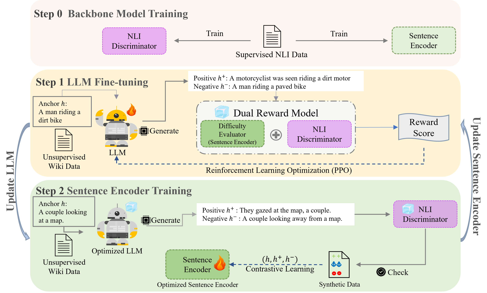

# AdaptCL

Code for LREC-COLING 2024 paper **"Adaptive Reinforcement Tuning Language Models as Hard Data Generators for Sentence Representation"**

We use a http api to balance the usage of two A6000 gpus.

AdaptCL/PPO_LLM/run_first.sh (modify base on the model used)

AdaptCL/PPO_LLM/run_second.sh

vllm is used to generate samples.

## Model Framework


I am suggesting using different LLM at different stage, for better performance.

## Citing

```
@inproceedings{wu24coling,
    title = {Adaptive Reinforcement Tuning Language Models as Hard Data Generators for Sentence Representation},
    author = {Bo Xu and Yifei Wu and Shouang Wei and Ming Du and Hongya Wang},
    booktitle = {LREC-COLING},
    month = {May},
    year = {2024}
}
```
